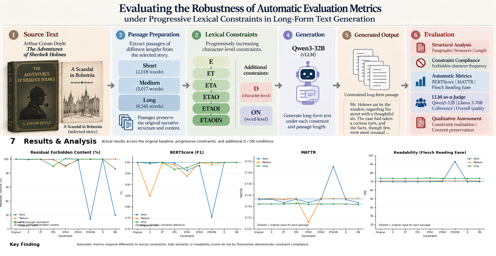

# Evaluating the Robustness of Automatic Evaluation Metrics under Progressive Lexical Constraints

This repository contains the code, experimental data, and evaluation results for the Master's thesis **“Evaluating the Robustness of Automatic Evaluation Metrics under Progressive Lexical Constraints in Long-Form Text Generation.”**

The study investigates how automatic evaluation metrics behave when a language model is required to generate long-form text under increasingly restrictive lexical constraints.

## Overview

The experiment uses **Qwen3-32B** to generate constrained versions of Arthur Conan Doyle's *A Scandal in Bohemia*. The generated passages are evaluated across different passage lengths and progressively increasing lexical constraints.

The main research question is:

> **How robust are automatic evaluation metrics when long-form text generation is subject to progressively increasing lexical constraints?**

### Experimental Setup

| Component               | Configuration                                                                                                             |
| ----------------------- | ------------------------------------------------------------------------------------------------------------------------- |
| Language model          | Qwen3-32B                                                                                                                 |
| Source text             | *A Scandal in Bohemia*                                                                                                    |
| Passage lengths         | Short, Medium, Long                                                                                                       |
| Progressive constraints | E → ET → ETA → ETAO → ETAOI → ETAOIN                                                                                      |
| Additional constraints  | D, ON                                                                                                                     |
| Evaluation              | Structural analysis, constraint compliance, BERTScore, MATTR, Flesch Reading Ease, LLM-as-a-Judge, qualitative assessment |

## Experimental Pipeline

The experimental workflow consists of source-text preparation, progressive lexical constraint generation, and multi-dimensional evaluation.



## Evaluation

The generated passages are evaluated from several complementary perspectives.

### Structural Characteristics

The generated texts are compared with their source passages in terms of:

* paragraph preservation
* sentence preservation
* output length

### Constraint Compliance

Constraint compliance is evaluated by examining residual forbidden content under the imposed lexical constraints.

The experiment includes the progressive character-level sequence:

**E → ET → ETA → ETAO → ETAOI → ETAOIN**

Two additional conditions are evaluated separately:

* **D** — character-level constraint
* **ON** — word-level constraint

### Automatic Metrics

The following automatic metrics are used:

* **BERTScore** — semantic similarity
* **MATTR** — lexical diversity
* **Flesch Reading Ease** — readability

### LLM-as-a-Judge

Two language models are used as independent judges:

* Qwen3-32B
* Llama 3-70B

The generated passages are evaluated for **coherence** and **overall quality**.

### Qualitative Assessment

A generation-level qualitative assessment examines two complementary properties:

* **Constraint realisation**
* **Content preservation**

This allows cases where constraint realisation and preservation of the source content diverge to be examined separately.

## Repository Structure

```text
.
├── analysis/
│   ├── inspect_story.py
│   └── prepare_passages.py
│
├── assets/
│   └── thesis_pipeline.png
│
├── data/
│   ├── source/
│   └── processed/
│
├── generation/
│   ├── generate.py
│   ├── generate_d.py
│   ├── generate_on.py
│   └── jobs/
│
├── evaluation/
│   ├── metrics/
│   ├── llm_judge/
│   └── jobs/
│
├── results/
│   ├── bertscore/
│   ├── compliance/
│   ├── llm_judge/
│   ├── mattr/
│   └── readability/
│
└── README.md
```

## Results

The repository contains the generated evaluation results for the progressive **E–ETAOIN** conditions as well as the additional **D** and **ON** conditions.

The results include:

* structural measurements
* constraint-compliance results
* BERTScore
* MATTR
* readability
* LLM-as-a-Judge evaluations

The complete analysis and interpretation of these results are provided in the accompanying thesis.

## Related Work

This project is related to recent work on long-form generation and the evaluation of language models under complex instructions and constraints.

* **[LongWeave](https://github.com/ZackZikaiXiao/LongWeave)** — A long-form generation benchmark focusing on real-world relevance and verifiability, with a structured evaluation pipeline.
* **[LongGenBench](https://github.com/mozhu621/LongGenBench)** — A benchmark for evaluating long-form generation with detailed prompt instructions and constraints.

These projects provide useful reference points for the broader problem of evaluating long-form generation and instruction following.

## Reproducibility

The repository provides the scripts used for passage preparation, generation, evaluation, and result processing.

The experiments were conducted using **Qwen3-32B** with vLLM on GPU infrastructure provided by DFKI.

Detailed experimental parameters and evaluation procedures are documented in the thesis.

## Citation

If you use this repository or build upon this work, please cite:

```text
Fırat, E.D. (2026).
Evaluating the Robustness of Automatic Evaluation Metrics
under Progressive Lexical Constraints in Long-Form Text Generation.
Master's Thesis, GISMA University.
```
